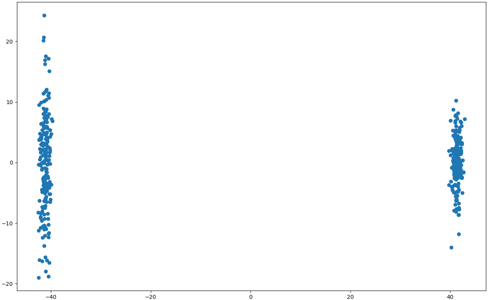

# Introduction
Just some random tinkering around with genomic dataset.

# About the Dataset used 
I have used the datasets available on the Harvard Dataverse link  .

# Some graphs obtained by the PCA algo

# Procedure 
Will write about it some day.
